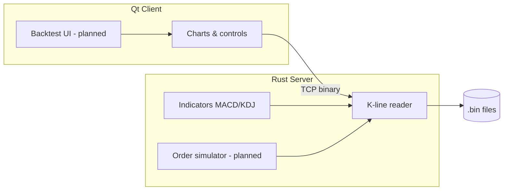

<div align="center">


# MockTrader

**Quantitative historical backtesting with simulated execution and chart review**

[中文文档](README.zh-CN.md)

</div>

---

MockTrader is a **local-first quantitative backtesting platform** for Chinese A-share (and similar) intraday history. It replays historical 5-minute bars, runs **custom indicator strategies**, **simulates order placement**, and **splits large parent orders into child fills**—then overlays **buy/sell markers** on the candlestick chart and reports **PnL / returns**.

The stack is a **Rust TCP server** (data + indicators + future simulation engine) and a **Qt 6 desktop client** (charts, controls, results).

## Highlights

| Capability | Description |
|------------|-------------|
| **Strategy backtest** | Run your own quantitative rules on historical bars and step through time bar-by-bar. |
| **Simulated orders** | Model automatic buy/sell signals with realistic timing on each bar. |
| **Large-order splitting** | Simulate breaking a parent block order into smaller child orders over multiple bars. |
| **Chart review** | Candlesticks with MACD / KDJ; inspect entries, exits, and trade markers on the K-line. |
| **Performance** | Review per-trade and aggregate returns, win rate, and equity curve (planned UI). |
| **Local data** | No cloud dependency; K-lines stored as compact binary files on disk. |

## Status

| Area | State |
|------|--------|
| 5-minute K-line storage & TCP API | **Available** |
| Candlestick chart, timeline scroll, prefetch | **Available** |
| MACD / KDJ (server-side, 24-byte indicator payload, i32×100) | **Available** |
| Strategy engine, order simulator, TWAP/split logic | **Planned** |
| Buy/sell markers & PnL panel on chart | **Planned** |

> The README describes the **product direction**. Implemented pieces are marked **Available**; trading simulation and backtest reporting are on the roadmap.

## Architecture

```
MockTrader/
├── Cargo.toml              # Rust workspace
├── crates/                 # mock-trader server (TCP, kline, indicators, …)
├── client/                 # Qt 6 desktop client
├── docs/
│   └── logo.png
└── data/
    ├── scripts/get_5min.py # Download & build .bin from baostock
    └── kline/5min/         # Historical bars (*.bin, gitignored by default)
```



## Prepare K-line data

Requires Python 3, `baostock`, and `pandas`.

```bash
pip install baostock pandas
python data/scripts/get_5min.py
```

Output example: `data/kline/5min/立讯精密_002475.bin`.

### Binary record (32 bytes, little-endian `i32` × 8)

| Field | Description |
|-------|-------------|
| `date` | `YYYYMMDD` |
| `time` | `HHmmss` (e.g. `093500` from baostock time string) |
| `open` / `high` / `low` / `close` | Price × 100 as integer |
| `volume` | Volume |
| `amount` | Amount ÷ 10000 as integer |

File name: `{display_name}_{symbol}.bin`.

## Run the server

From the repository root:

```bash
cargo run -p mock-trader
```

| Variable | Default |
|----------|---------|
| `TRADING_HOST` | `0.0.0.0` |
| `TRADING_PORT` | `9000` |
| `KLINE_DIR` | `data/kline/5min` |

## Build & run the client

Requires **Qt 6.5+** (Core, Gui, Widgets, Network, Charts).

```bash
cd client
cmake -S . -B build -DCMAKE_PREFIX_PATH="$(brew --prefix qt@6)"
cmake --build build -j
./build/mock_trader_client
```

| Variable | Default |
|----------|---------|
| `TRADING_TCP_HOST` | `127.0.0.1` |
| `TRADING_TCP_PORT` | `9000` |

## Client workflow (current)

1. Start the server, then launch the client. The home screen lists all `.bin` symbols under `KLINE_DIR`.
2. Open a symbol to load recent 5-minute history (~180 trading days in memory) and show the **latest 100 bars** by default.
3. Drag the **timeline** at the bottom to scroll; older bars are prefetched near the left edge.
4. View **MACD** (DIF, DEA, histogram) and **KDJ** computed on the server; colored readouts match chart lines.
5. Double-click the main chart for OHLC detail; high/low labels track the visible window.

Tune bar counts in `client/src/KlineLoadConfig.h` (`VisibleBarCount`, `InitialBarLimit`, etc.).

## TCP protocol (binary frames)

Frame: `[u8 type][u32 LE payload length][payload]`

| Type | Value | Direction | Description |
|------|-------|-----------|-------------|
| `ListStocks` | 1 | C→S | Empty payload |
| `GetCandles` | 2 | C→S | `symbol` + optional `before_index` + `limit` |
| `StockList` | 101 | S→C | UTF-8 stock list |
| `CandleChunk` | 102 | S→C | `start_index`, `total`, raw K-line bytes, indicator bytes |
| `Error` | 255 | S→C | Error text |

Each bar: **32-byte candle** + **24-byte indicators** (6× `i32` LE, value = round(indicator×100); `i32::MIN` = invalid: `macd_dif`, `macd_dea`, `macd_bar`, `kdj_k`, `kdj_d`, `kdj_j`).

`GetCandles` without `before_index` returns the latest `limit` records at the end of the file.

Details: `crates/src/protocol/binary.rs`.

## Development

```bash
cargo test -p mock-trader
cargo clean
rm -rf client/build
```

CI workflows: `.github/workflows/mock_trader_server.yml`, `mock_trader_client.yml`.

`.gitignore` excludes `target/`, `client/build/`, local `*.bin`, and IDE metadata.

## License

See repository license file if present; otherwise treat as private / all rights reserved by the project owner.
