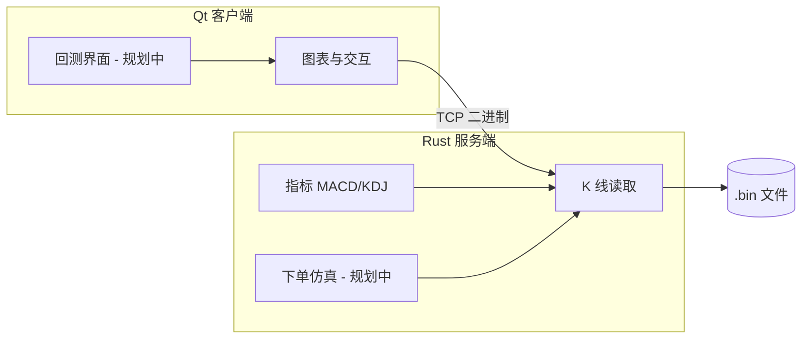

<div align="center">


# MockTrader

**量化历史回测 · 模拟拆单下单 · K 线买卖点与收益复盘**

[English](README.md)

</div>

---

MockTrader 是一款**本地优先**的量化历史回测软件，面向 A 股等市场的分钟级行情。系统在历史 5 分钟 K 线上回放行情，支持**自定义量化指标与策略**、**模拟自动下单**，并可**将大单拆分为多笔小单**逐步成交；回测结束后可在 **K 线图上查看买入点、卖出点**，并统计**收益与绩效**。

技术栈：**Rust TCP 服务端**（行情、指标、后续仿真引擎）+ **Qt 6 桌面客户端**（图表、交互、结果展示）。

## 功能亮点

| 能力 | 说明 |
|------|------|
| **策略回测** | 在历史 K 线上按 bar 推进，执行自定义量化规则。 |
| **模拟下单** | 根据信号在对应 K 线时刻模拟买入/卖出。 |
| **大单拆小单** | 模拟母单按时间或成交量拆成多笔子单成交。 |
| **图表复盘** | 蜡烛图 + MACD / KDJ；在 K 线上标注买卖点。 |
| **收益分析** | 查看单笔盈亏、胜率、资金曲线等（界面规划中）。 |
| **本地数据** | 行情以二进制文件落地，无需依赖云端。 |

## 开发状态

| 模块 | 状态 |
|------|------|
| 5 分钟 K 线存储与 TCP 接口 | **已实现** |
| 蜡烛图、时间轴拖动、向左预加载 | **已实现** |
| MACD / KDJ（服务端计算，48 字节指标包） | **已实现** |
| 策略引擎、下单仿真、拆单逻辑 | **规划中** |
| K 线买卖点标记与收益面板 | **规划中** |

> 本文档描述**产品目标**；表中 **已实现** 为当前版本能力，交易仿真与回测报表仍在迭代中。

## 项目结构

```
MockTrader/
├── Cargo.toml              # Rust workspace
├── crates/                 # mock-trader 服务端
├── client/                 # Qt 6 客户端
├── docs/
│   └── logo.png
└── data/
    ├── scripts/get_5min.py # 从 baostock 生成 .bin
    └── kline/5min/         # K 线数据（*.bin，默认不入库）
```



## 准备 K 线数据

依赖 Python 3、`baostock`、`pandas`。

```bash
pip install baostock pandas
python data/scripts/get_5min.py
```

生成示例：`data/kline/5min/立讯精密_002475.bin`。

### 二进制格式（每条 32 字节，小端 int32×8）

| 字段 | 说明 |
|------|------|
| date | `YYYYMMDD` |
| time | `HHmmss`（由 baostock 时间串第 8–14 位得到，如 `093500`） |
| open / high / low / close | 价格 ×100 的整数 |
| volume | 成交量 |
| amount | 成交额 ÷10000 的整数 |

文件名：`{名称}_{代码}.bin`。

> 若曾用旧版脚本（`time` 使用 `slice(-6)`），请重新执行 `get_5min.py` 覆盖数据。

## 运行服务端

在项目根目录：

```bash
cargo run -p mock-trader
```

| 环境变量 | 默认值 |
|----------|--------|
| `TRADING_HOST` | `0.0.0.0` |
| `TRADING_PORT` | `9000` |
| `KLINE_DIR` | `data/kline/5min` |

## 构建并运行客户端

需要 Qt **6.5+**（Core、Gui、Widgets、Network、Charts）。

```bash
cd client
cmake -S . -B build -DCMAKE_PREFIX_PATH="$(brew --prefix qt@6)"
cmake --build build -j
./build/mock_trader_client
```

| 环境变量 | 默认值 |
|----------|--------|
| `TRADING_TCP_HOST` | `127.0.0.1` |
| `TRADING_TCP_PORT` | `9000` |

## 客户端使用（当前版本）

1. 启动服务端后打开客户端，首页列出 `KLINE_DIR` 下所有 `.bin` 股票。
2. 进入详情后加载最近约 **180 个交易日** 的 5 分钟线，默认显示**最新 100 根** K 线。
3. 拖动底部**时间轴**查看更早数据；接近已加载左边界时自动预取约 30 个交易日。
4. **MACD**（DIF、DEA、柱）与 **KDJ** 由服务端计算；顶部读数颜色与图中折线/柱一致。
5. 主图双击显示 OHLC；可见区间最高/最低价标注随滚动更新。

加载条数可在 `client/src/KlineLoadConfig.h` 调整（`VisibleBarCount`、`InitialBarLimit` 等）。

## TCP 协议（二进制帧）

帧结构：`[u8 消息类型][u32 小端 payload 长度][payload]`

| 类型 | 值 | 方向 | 说明 |
|------|-----|------|------|
| ListStocks | 1 | C→S | 无 payload |
| GetCandles | 2 | C→S | symbol + 可选 `before_index` + `limit` |
| StockList | 101 | S→C | 股票列表 UTF-8 |
| CandleChunk | 102 | S→C | `start_index`、`total`、原始 K 线、指标字节 |
| Error | 255 | S→C | 错误文本 |

每根 K 线：**32 字节行情** + **48 字节指标**（6×f64 LE：`macd_dif`、`macd_dea`、`macd_bar`、`kdj_k`、`kdj_d`、`kdj_j`）。

`GetCandles` 未带 `before_index` 时返回文件末尾（最新）的 `limit` 条记录。

协议细节见 `crates/src/protocol/binary.rs`。

## 开发说明

```bash
cargo test -p mock-trader
cargo clean
rm -rf client/build
```

CI：`.github/workflows/mock_trader_server.yml`、`mock_trader_client.yml`。

`.gitignore` 已忽略 `target/`、`client/build/`、本地 `*.bin` 等。

## 许可

以仓库内 LICENSE 为准；若无则归项目作者所有。
